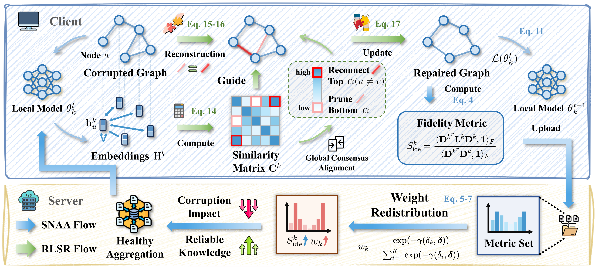








# 👋🏻 Welcome!

Hello! I am Jiaqi Liu (刘家琦), a third-year undergraduate student at the [School of Computer Science](https://cs.whu.edu.cn/), [Wuhan University](https://www.whu.edu.cn/).

Currently, I am fortunate to be advised by [Prof. Mang Ye](https://marswhu.github.io/index.html) at the MARS Lab. I also have the great opportunity to work as a research assistant with [Prof. Qiang Yang](https://cse.hkust.edu.hk/~qyang/) at HKUST, focusing on visual representation learning for complex real-world data.

🎓 I am actively seeking Fall 2027 Ph.D. opportunities in Computer Science! Please feel free to reach out if you are interested in my profile.

# 🔎 Research Interests
My long-term research goal is to build intelligent, adaptable, and multimodal systems that can reason about the real world. Currently, my focus encompasses the following areas:

- **Federated & Graph Learning:** Exploring how to efficiently model complex structural data and enable continual, collaborative learning across distributed environments without compromising privacy.

- **Large Language Models & Agents:** Building upon my prior research in distributed systems and structured data, I aim to explore how multi-agent collaboration and symbolic knowledge representations can enhance the reasoning and alignment capabilities of Foundation Models.

- **Vision-Language Models (VLMs) & Multimodal Reasoning:** Moving beyond linguistic or graph representations, I am eager to explore Vision-Language Models (VLMs) as a new frontier. My goal is to investigate how to build robust multimodal systems that can align visual perception with complex, real-world reasoning.

<!-- - **Computer Vision & AI for Science (AI4S):** Developing robust visual perception algorithms and extending deep learning to interdisciplinary challenges, such as analyzing complex astronomical data. -->

# 🔥 News
- *2026.02*: &nbsp;🎉🎉 One paper was accepted by **CVPR 2026**. See you in Denver!

# 📝 Publications 

**† Equal Contribution**

CVPR 2026

<a href="../files/FedSDR.pdf" style="color: black; text-decoration: none;"><strong>FedSDR: Federated Graph Learning with Structural Noise Detection and Reconstruction</strong></a>

**Jiaqi Liu†**, Zihan Tan†, Guancheng Wan, Wenke Huang, He Li, Mang Ye

<strong style="color: red;"><i>Highlight Presentation</i></strong>

We propose **FedSDR**, a spectra-based federated graph learning framework, featuring two key designs: (1) structural noise-aware aggregation for global noise detection and mitigation, and (2) robust local structure reconstruction guided by healthy global knowledge to repair corrupted graphs.

# 🎖 Honors and Awards

2026.03 Scientific Innovation Pioneer (**Sole Recipient** among all undergraduate and graduate students in the School)

2025.11 **National First Prize** in the 19th "Challenge Cup" Academic and Scientific Works Competition (Top 0.07% nationwide)

2025.11 Fiberhome Communication Scholarship

2025.09 Outstanding Student Scholarship

2025.05 Lei Jun Computer Innovation and Development Fund

# 📖 Educations

  

    

      <strong>2023.09 - Now</strong> 
      Undergraduate, Software Engineering, Wuhan University 
    

    

      
    

  

<!-- # 💬 Invited Talks
- *2021.06*, Lorem ipsum dolor sit amet, consectetur adipiscing elit. Vivamus ornare aliquet ipsum, ac tempus justo dapibus sit amet. 
- *2021.03*, Lorem ipsum dolor sit amet, consectetur adipiscing elit. Vivamus ornare aliquet ipsum, ac tempus justo dapibus sit amet.  \| [\[video\]](https://github.com/)

# 💻 Internships
- *2019.05 - 2020.02*, [Lorem](https://github.com/), China. -->